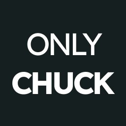

<section align="center">
<h1 style="font-size: 3.5rem">ONLY <b>CHUCK</b></h1>

    
    

 

</section>

## Descrizione
Questo progetto è un interfaccia grafica per visualizzare i dati forniti da [`https://api.chucknorris.io`](`https://api.chucknorris.io`)

In particolare è possibile
- Visualizzare una frase random di Chuck Norris
- Scegliere la categoria tra quelle disponibili
- Copiare e condividere "la perla di Chuck"

Sono stati inseriti degli effetti sonori:
- quando si copia e condivide una frase
- quando viene estratta una categoria
- per ogni tick della ruota dei premi (2 suoni diversi)

## API
Tutto il progetto si basa su `https://api.chucknorris.io/random` per generare un joke in modo randomico.

Le categorie sono prefissate in [`src/utils/category2Symbol.json`](src/utils/category2Symbol.json)</a> poichè:
- sono collegate ad un icona
- non cambiano spesso (si spera)

## PWA
Il sito è installabile, in quanto PWA.
È stato quindi inserito il webmanifest e il service worker.

## About
Il progetto è stato sviluppato interamente (design e codice) da [Jonathan Caputo](mailto:jonathan-caputo@hotmail.com)

## Disclamer
Questo è un progetto scolastico, realizzato tra marzo e aprile 2023.

Ma la vera domanda rimane: <b>CHI È CHUCK NORRIS??<b>